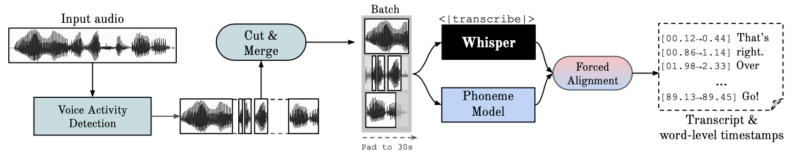

<h1 align="center">Speaker Diarization Using OpenAI Whisper</h1>

## What is it
본 레포지포리는 https://github.com/MahmoudAshraf97/whisper-diarization 를 참조하고 있음을 밝힙니다. 

이 프로젝트는 Whisper ASR 기능을 Voice Activity Detection (VAD) 및 Speaker Embedding 과 결합하여, Whisper에서 생성된 대본의 각 문장에 대한 화자를 식별합니다. 

1. **Demucs (음성 분리)**

requirements.txt에서 다운받은 Demucs를 사용하여, 오디오에서 보컬을 추출합니다. 이는 화자 임베딩의 정확도를 높이기 위함입니다. 

2. **Whisper (음성 인식)**

Whisper, 음성 인식 (ASR) 엔진을 사용하여, 오디오 (보컬) 입력을 받아 텍스트로 변환합니다. 이 코드에서는 faster_whipser를 사용하고 있습니다. 이는 WhisperX 3버전에서 도입한 것으로, CTranslate2를 사용하여 OpenAI의 Whisper모델을 다시 구현한 것입니다. 

그리고, requirements.txt에서 다운받은 WhisperX 사용하여 텍스트의 타임 스탬프를 보정하고 정렬하여 정확한 타이밍과 일치하는 문장을 생성합니다. WhisperX는 시간 이동으로 인한 오류를 최소화하여 보다 정확한 결과를 얻을 수 있도록 도와줍니다. 아래는 WhisperX의 동작 원리입니다. 

 

Whisper는 매우 정확한 텍스트 변환을 제공하지만, 단어별 타임스탬프가아니라 발화 단위로 타임스탬프를 제공하며, 이는 몇 초의 정확도 차이를 가질 수 있습니다. WhisperX는 Whisper의 기능을 확장하여 단어 수준의 타임스탬프 기능을 추가합니다. 이는 wav2vec2.0 과 같은 phonme 기반 ASR 모델을 통해 forced alignment 프로세스를 사용하여 타임스탬프의 정확도를 높입니다. 이는 각 단어의 정확한 시작 및 끝 타임스탬프를 제공합니다. 

3. **NeMo (화자 구분)**

NeMo는 NVIDIA가 개발한 대화형 AI 애플리케이션을 위한 툴킷으로, 다양한 음성 및 언어 처리 모델을 제공합니다. WhisperX, MarbleNet, TitaNet 등은 NeMo Toolkit 내에서 제공되는 여러 모델 중 일부입니다.

 

보컬은 MarbleNet으로 전달되어 VAD 및 세그먼트화에 사용되어 공백을 제거합니다. VAD는 오디오 스트림 내에서 음성이 언제 발생하는지 감지하는 기술입니다. 음성과 비음성을 구별하여, 오디오 파일에서 말하는 부분만을 식별하고 추출합니다. 오디오 스트림에서 화자가 말을 시작하거나 멈출 때를 파악할 수 있습니다.

그 후, TitaNet을 사용하여 각 세그먼트의 화자 임베딩을 추출하여 WhisperX에서 생성된 타임 스탬프에 따라 각 단어의 화자를 감지합니다. 

## Whisper
위스퍼는 사이즈 별로 총 5가지의 모델이 존재합니다. 이 중 4가지는 영어 전용 버전을 제공합니다. 각 모델의 이름과 대략적인 메모리 유구 사항 및 속도는 아래 테이블에 명시되어 있습니다. 이 내용은 https://github.com/openai/whisper/tree/main 을 참조한 것입니다. 

|  Size  | Parameters | English-only model | Multilingual model | Required VRAM | Relative speed |
|:------:|:----------:|:------------------:|:------------------:|:-------------:|:--------------:|
|  tiny  |    39 M    |     `tiny.en`      |       `tiny`       |     ~1 GB     |      ~32x      |
|  base  |    74 M    |     `base.en`      |       `base`       |     ~1 GB     |      ~16x      |
| small  |   244 M    |     `small.en`     |      `small`       |     ~2 GB     |      ~6x       |
| medium |   769 M    |    `medium.en`     |      `medium`      |     ~5 GB     |      ~2x       |
| large  |   1550 M   |        N/A         |      `large`       |    ~10 GB     |       1x       |

이 코드에서는 medium을 사용하였습니다. 

## Installation
이 레포지토리는 **파이썬 3.10 이상**을 요구합니다. 

`FFMPEG` 와 `Cython` 를 우선 설치해야 합니다. 
```
# cython 설치
pip install cython
```

```
# on Ubuntu or Debian
sudo apt update && sudo apt install ffmpeg

# on Arch Linux
sudo pacman -S ffmpeg

# on MacOS using Homebrew (https://brew.sh/)
brew install ffmpeg

# on Windows using Chocolatey (https://chocolatey.org/)
choco install ffmpeg

# on Windows using Scoop (https://scoop.sh/)
scoop install ffmpeg
```
```
# requirements.txt 설치
pip install -r requirements.txt
```
```
pip install torch torchvision
pip install nemo_toolkit[nlp]
```

## Usage 

```
python diarize.py -a AUDIO_FILE_NAME
```

만약 시스템이 충분한 VRAM(>=10GB)을 가지고 있다면, diarize_parallel.py를 대신 사용할 수 있습니다. diarize.py와 diarize_parallel.py의 차이점은 후자는 NeMo와 Whisper를 병렬로 실행한다는 점입니다. 
이는 일부 경우에 유용할 수 있으며 두 모델이 서로 의존하지 않기 때문에 결과는 동일합니다. 

## Command Line Options

- `-a AUDIO_FILE_NAME`: 처리할 오디오 파일의 이름
- `--no-stem`: 음성 / 백그라운드 소리 분리 비활성화
- `--whisper-model`: ASR(음성 인식)에 사용될 모델, 기본값: `medium`
- `--suppress_numerals`: 숫자를 숫자가 아닌 발음된 문자로 변환하여 기록함으로써, 정렬 정확도를 향상
- `--device`: 사용할 장치 선택, 기본값: `cuda`
- `--language`: 수동으로 언어 선택
- `--batch-size`: 추론을 위한 배치 크기, 메모리 부족 시 줄이고, 비배치 추론을 위해 0으로 설정

##